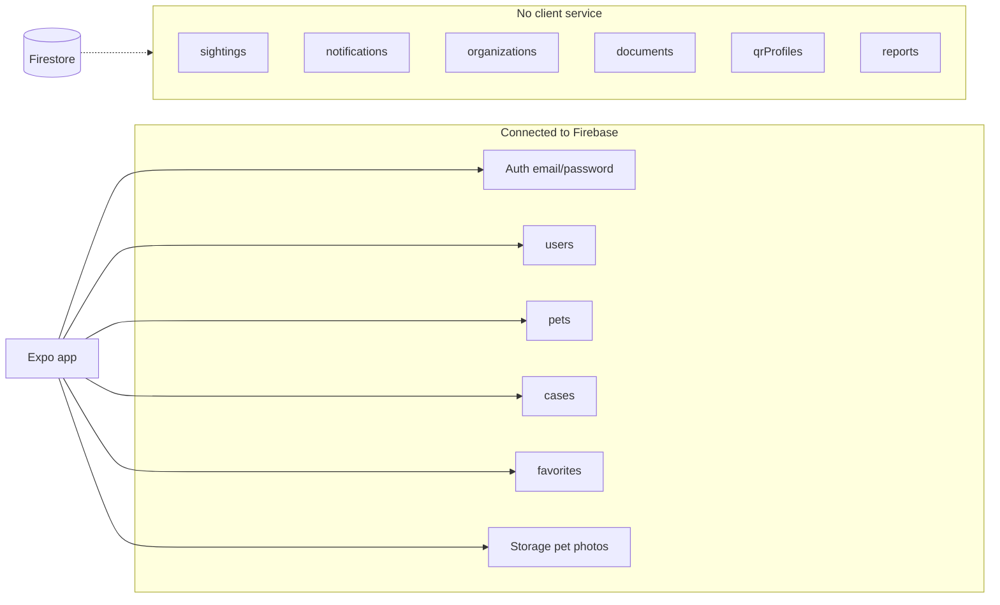

# WUFFI MVP Functionality Audit

**Date:** June 2026  
**Scope:** All user-facing flows in `app/`, data layer in `src/services/` and `src/hooks/`, Firebase rules/indexes, validation schemas  
**Focus:** Functionality only (not visual design)  
**Method:** Static code review of routes, services, hooks, stores, schemas, and Firestore rules. No new features implemented.

---

## Executive summary

WUFFI is a **real Firebase-backed MVP**, not a mock prototype. Core paths — email auth, personal pet notebook, public case publishing, explore/search/filters, case detail with contact actions, and favorites — are wired to Firestore and (partially) Storage.

There is **no mock or seed data** in application code. When Firebase env vars are missing, reads return empty arrays and writes throw; this is intentional graceful degradation.

The largest functional gaps for a lost-pet product are:

1. **Sightings** — route exists, rules/indexes exist, UI is empty  
2. **Notifications / Alerts tab** — empty placeholder  
3. **Pet ↔ lost case linkage** — reporting lost does not update `pet.status` or `activeLostCaseId`  
4. **“Nearby” on Home** — shows recent cases globally, not geo-proximity (geohash is written but never queried)  
5. **Case create flows** — no photo upload, weak validation (Zod schemas defined but unused), several form fields stored in state but not exposed in UI

---

## Status legend

| Status | Meaning |
|--------|---------|
| **Working** | End-to-end flow completes with real Firebase when configured |
| **Partial** | UI exists and some backend wiring works, but behavior is incomplete or misleading |
| **Missing** | Route/screen/type may exist, but no functional implementation |
| **Broken** | User-visible flow fails or produces inconsistent data/state |

## Priority legend

| Priority | Meaning |
|----------|---------|
| **High** | Blocks core MVP value or causes user confusion/data inconsistency |
| **Medium** | Important for polish or trust, but workaround exists |
| **Low** | Future-phase feature; types/rules may already exist |

---

## Architecture snapshot

**Stack:** Expo 53, Expo Router, React Query, Zustand (`exploreStore`, `authStore`), Firebase Auth + Firestore + Storage, i18next (default `es-AR`).

---

## User flows

### 1. App entry & session

| Flow | Status | Priority | Notes |
|------|--------|----------|-------|
| Splash → redirect | **Working** | — | `app/index.tsx` redirects based on auth |
| Auth gate | **Working** | — | Unauthenticated users forced to `/(auth)/login` |
| Session persistence | **Working** | — | Firebase `onAuthStateChanged` + `useAuthInit` |
| Firebase not configured | **Partial** | Medium | `FirebaseSetupBanner` on login; reads empty, writes fail |

**Firebase:** Auth ✅ · Firestore `users` ✅ (auto-created on first sign-in)

---

### 2. Authentication

| Flow | Status | Priority | Notes |
|------|--------|----------|-------|
| Email login | **Working** | — | `loginSchema` (Zod) validated |
| Register | **Working** | — | `registerSchema` (Zod); Firestore profile created via `getOrCreateUser` on auth state change |
| Forgot password | **Working** | — | `forgotPasswordSchema` (Zod) |
| Logout | **Working** | — | Clears auth store + React Query |
| Google Sign-In | **Missing** | Low | `googleAuth.ts` exists; `isGoogleSignInReady = false`; not exposed in login UI |
| Apple Sign-In | **Missing** | Low | Not implemented |

**Validations:** Auth screens use Zod ✅  
**Missing validations:** None critical for auth MVP

---

### 3. Home tab

| Flow | Status | Priority | Notes |
|------|--------|----------|-------|
| Greeting + location subtitle | **Partial** | Low | Location from `userProfile` city/province; user cannot edit location in app |
| My pets list | **Working** | — | `usePets` → Firestore `pets` |
| Empty pets CTA | **Working** | — | Navigates to create personal pet |
| Quick actions | **Working** | — | All 5 create routes linked |
| Nearby alerts | **Partial** | **High** | Label implies proximity; `getRecentCasesNearby()` is `exploreCases()` with no geo filter — recent cases globally |
| Recent favorites summary | **Working** | — | Count from `useFavorites`; link to `/favorites` |
| Notification bell | **Missing** | Medium | `ScreenHeader` shows icon; Home passes no `onNotificationPress` — inert UI |

**Firebase:** `pets`, `cases`, `favorites` ✅  
**Missing:** `notifications` ❌ · geo query on `locationGeoHash` ❌

---

### 4. Explore tab

| Flow | Status | Priority | Notes |
|------|--------|----------|-------|
| Case type tabs (lost/found/adoption/transit) | **Working** | — | Filters Firestore query by `caseType` |
| Search (name, city, neighborhood text) | **Working** | — | Client-side filter on fetched results |
| Pull to refresh | **Working** | — | React Query `refetch` |
| Favorite toggle on cards | **Working** | — | Requires signed-in user |
| Empty state | **Working** | — | When no cases match |
| Filters modal | **Partial** | Medium | Province/city/neighborhood/species applied; species/neighborhood filtered client-side after fetch; province picker shows 8 of 24 provinces |
| Map (native) | **Partial** | Medium | `react-native-maps` markers from `useExploreCases`; bottom card always shows **first** case, not selected marker |
| Map (web) | **Partial** | Low | Intentional fallback: banner + case list, no map component |
| List/map view toggle | **Missing** | Low | `exploreStore.viewMode` defined but never used |

**Firebase:** `cases` read (public rules) ✅ · `favorites` ✅  
**Missing:** Geohash-based explore ❌

---

### 5. Alerts tab

| Flow | Status | Priority | Notes |
|------|--------|----------|-------|
| Notifications list | **Missing** | **High** | `EmptyState` only; no service, no Firestore reads |
| Push notifications | **Missing** | **High** | `User.pushToken` and `notificationSettings` in types; never written from app |

**Firebase:** `notifications` collection has rules + indexes but **no client code**

---

### 6. Profile tab

| Flow | Status | Priority | Notes |
|------|--------|----------|-------|
| Display name / email | **Working** | — | From Firestore `users` |
| Location chip | **Partial** | Low | Display only if set in Firestore; no edit UI |
| Avatar | **Partial** | Low | Static icon; `userAvatarPath` in Storage helpers unused |
| Menu → Favorites | **Working** | — | |
| Menu → Settings | **Partial** | Medium | Opens read-only settings |
| My pets (top 3) | **Working** | — | |
| My cases (top 3) | **Working** | — | `useMyCases` |
| Logout | **Working** | — | |

**Firebase:** `users`, `pets`, `cases` ✅  
**Missing:** Profile edit (`updateUser`) ❌

---

### 7. Personal pet notebook

| Flow | Status | Priority | Notes |
|------|--------|----------|-------|
| Create pet | **Working** | — | `petSchema` + `parsePetAgeInput`; writes to `pets` |
| View pet detail | **Working** | — | `usePet`; species badge; age, breed, health info |
| Edit pet | **Working** | — | Full form + `petSchema`; photo upload to Storage on edit |
| Add photo on create | **Missing** | Medium | Create flow has no image picker |
| Delete pet | **Missing** | Low | `deletePet` service + `useDeletePet` hook exist; no UI |
| Vaccines | **Missing** | Low | Type + Firestore field supported in service; no UI |
| Report lost from pet | **Partial** | **High** | Navigates to lost create with `petId`; pre-fills name/species/photos — but **does not** set `pet.status = 'lost'` or `activeLostCaseId` after publish |
| Pet status badge | **Partial** | **High** | UI shows safe/lost status, but status never changes when lost case is created |

**Firebase:** `pets` CRUD (delete unused in UI) ✅ · Storage `pets/{id}/photos/` ✅ on edit only  
**Validations:** Zod on create/edit ✅

---

### 8. Create case flows

All flows use a single `[step]` route (always step 1). Data: local `useState` → `useCreateCase` → Firestore `cases`.

| Flow | Status | Priority | Notes |
|------|--------|----------|-------|
| Create hub (`/create`) | **Working** | — | Navigation only |
| Lost case | **Partial** | **High** | Publishes to Firestore; GPS or `DEFAULT_LOCATION` fallback; copies pet photos if linked; **no pet status update**; province picker shows 6/24 provinces; **no case photos**; manual `required` check only |
| Found case | **Partial** | Medium | Publishes; `temporaryCare` defaults to `with_finder` — `CARE_OPTIONS` defined in file but **no UI selector**; empty `photoUrls`; province 4/24 |
| Adoption case | **Partial** | Medium | Publishes; vaccinated/neutered toggles work; province hardcoded to `DEFAULT_PROVINCE_ID`; no photos |
| Transit case | **Partial** | Medium | Publishes; `needsHome` toggle; province hardcoded to default; no photos |
| Multi-step wizard | **Missing** | Low | `[step]` param is cosmetic |
| Case photo upload | **Missing** | **High** | `casePhotoPath` helper exists; never used |
| Link found case to personal pet | **Missing** | Medium | No `petId` linking on found flow |

**Firebase:** `cases` create ✅ · `locationGeoHash` written ✅  
**Validations:** Zod schemas (`createLostCaseSchema`, etc.) exist in `src/schemas/index.ts` but **are not imported by any create screen** — only empty-field checks  
**Missing:** `updateCaseStatus` UI ❌ · case edit ❌ · case delete ❌ (rules allow owner delete)

---

### 9. Case detail & interactions

| Flow | Status | Priority | Notes |
|------|--------|----------|-------|
| View case | **Working** | — | Public read; all case types |
| WhatsApp / call | **Working** | — | Opens external apps when contact fields set |
| Share | **Working** | — | Native share with deep link |
| Favorite toggle | **Working** | — | Header heart on case detail |
| Report sighting (lost cases) | **Missing** | **High** | Button navigates to `/case/[id]/sighting` — **EmptyState placeholder only** |
| Case status management | **Missing** | **High** | Owner cannot mark found/closed/adopted; `useUpdateCaseStatus` unused |
| Sighting / favorite counters | **Partial** | Low | `sightingCount`, `favoriteCount` initialized to 0; never incremented |

**Firebase:** `cases` read ✅ · `favorites` ✅ · `sightings` ❌

---

### 10. Favorites

| Flow | Status | Priority | Notes |
|------|--------|----------|-------|
| Toggle favorite (explore + detail) | **Working** | — | Deterministic doc ID in `favorites` |
| Favorites list | **Working** | — | Resolves case IDs via `useCase` |
| Unfavorite from list | **Missing** | Medium | Cards show `isFavorite` hardcoded; no toggle on favorites screen |
| Favorite organizations | **Missing** | Low | Type supports `organization`; no org UI or service usage |

**Firebase:** `favorites` ✅

---

### 11. Settings

| Flow | Status | Priority | Notes |
|------|--------|----------|-------|
| View account email | **Working** | — | Read from profile |
| View language | **Partial** | Medium | Displays current locale; **no switcher**; changing locale does not call `updateUser` |
| Notification preferences | **Missing** | Medium | `notificationSettings` stored on user doc at creation; no UI |
| Edit profile (name, phone, location) | **Missing** | Medium | `updateUser` service exists; unused |

**Status:** Placeholder screen with real read-only data.

---

## Firestore collections audit

Defined in `src/constants/index.ts`:

| Collection | Security rules | Indexes | Client service | UI connected | Status |
|------------|---------------|---------|----------------|--------------|--------|
| `users` | ✅ | — | ✅ `userService` | Partial (read-only) | **Partial** |
| `pets` | ✅ owner-only read | ✅ | ✅ `petService` | ✅ | **Working** |
| `cases` | ✅ public read | ✅ | ✅ `caseService` | ✅ | **Working** (create/read; limited update) |
| `cases/{id}/updates` | ✅ | — | ❌ | ❌ | **Missing** |
| `favorites` | ✅ | ✅ | ✅ `favoriteService` | ✅ | **Working** |
| `sightings` | ✅ | ✅ | ❌ | Placeholder screen | **Missing** |
| `notifications` | ✅ | ✅ | ❌ | Empty alerts tab | **Missing** |
| `organizations` | ✅ | — | ❌ | ❌ | **Missing** |
| `documents` | ✅ | — | ❌ | ❌ | **Missing** |
| `qrProfiles` | ✅ | — | ❌ | ❌ | **Missing** |
| `reports` | ✅ | — | ❌ | ❌ | **Missing** |

---

## Firebase connections summary

### Working

- Firebase SDK init (Auth, Firestore, Storage) from `EXPO_PUBLIC_FIREBASE_*`
- Email/password authentication + password reset
- Firestore: create/read/update for `users`, `pets`, `cases`, `favorites`
- Storage: pet photo upload on edit screen
- React Query cache invalidation on mutations
- `scripts/verify-firebase.mjs` for live connectivity check

### Partial

- Storage: only pet edit photos; `deleteFile` never called
- `isFirebaseConfigured()` does not validate `storageBucket`
- Geohash written on case create, never queried
- Google auth code present, not productized
- User profile update service unused

### Missing

- Sightings CRUD
- Notifications CRUD + FCM push token registration
- Organizations, documents, QR profiles, moderation reports
- Case photo upload on create
- Avatar upload
- Case subcollection `updates` (timeline/activity feed)
- Counter maintenance (`favoriteCount`, `sightingCount`)
- Pet `activeLostCaseId` / status sync when publishing lost case

---

## Validation audit

| Area | Zod schema | Used in UI | Gap |
|------|------------|------------|-----|
| Login | ✅ | ✅ | — |
| Register | ✅ | ✅ | — |
| Forgot password | ✅ | ✅ | — |
| Create/edit pet | ✅ | ✅ | Age UX validated via `parsePetAgeInput` |
| Create lost case | ✅ | ❌ | Manual empty check only |
| Create found case | ✅ | ❌ | Manual empty check only |
| Create adoption case | ✅ | ❌ | Manual empty check only |
| Create transit case | ✅ | ❌ | Manual empty check only |
| Favorites | ❌ | — | Low risk |
| Sightings | ❌ | — | No form |
| User profile edit | ❌ | — | No form |

**Risk:** Case forms accept very short descriptions/titles and invalid phone formats because Zod is bypassed.

---

## Placeholder screens & inert UI

| Screen / element | File | What user sees | Backend |
|------------------|------|----------------|---------|
| Alerts tab | `app/(tabs)/alerts.tsx` | Empty state | None |
| Report sighting | `app/case/[id]/sighting.tsx` | Empty state + case ID subtitle | None |
| Settings | `app/settings/index.tsx` | Read-only cards | Reads `users` only |
| Web map fallback | `app/explore/map.tsx` | Banner + list | Reads cases |
| Home notification bell | `app/(tabs)/index.tsx` | Icon, no action | None |
| Google Sign-In | — | Not shown | Stub in `googleAuth.ts` |

**Visual placeholders (not mock data):** Species-specific icons/backgrounds when pet/case has no photo (`PET_SPECIES_PLACEHOLDER_*`).

---

## Mock data audit

**Result: No mock, fake, dummy, seed, or sample data layers found** in `app/` or `src/`.

Fallbacks that are **not** mock data:

- `DEFAULT_LOCATION` (CABA coordinates) when GPS permission denied — used for case location fields
- Empty arrays / `null` when Firebase unconfigured — documented policy in `docs/DEVELOPMENT-RULES.md`
- `normalizePetSpecies()` coerces legacy Firestore values to `dog` | `cat`

---

## UI elements not connected to real data

| UI element | Expected behavior | Actual |
|------------|-------------------|--------|
| Home “Nearby alerts” | Geo-proximity cases | Recent cases globally |
| Home notification bell | Open alerts / notifications | No handler |
| Alerts tab | Notification feed | Static empty state |
| Report sighting button + screen | Submit sighting to Firestore | Empty state |
| Pet “lost” status badge | Reflects active lost case | Always `safe` unless manually set in Firestore |
| Settings language row | Change app locale + persist | Display only |
| Settings account row | Edit profile | Display only |
| Map bottom card (native) | Selected marker preview | Always first case in list |
| Found case “temporary care” | User selects care location | Hardcoded `with_finder` |
| Province pickers in create flows | All 24 AR provinces | Subset (4–6) or fixed default |
| Favorites list heart | Toggle unfavorite | Display-only favorite state |
| Profile avatar | User photo from Storage | Static Ionicons icon |
| `exploreStore.viewMode` | Switch list/map in explore tab | Never read |
| `useDeletePet` | Delete pet from UI | Hook unused |
| `useUpdateCaseStatus` | Close/resolve cases | Hook unused |
| `useUserProfile` | Fetch profile | Hook disabled (`enabled: false`) |

---

## Hooks & services coverage

| Hook / service | Implemented | Used in UI |
|----------------|-------------|------------|
| `useAuthInit`, `useAuth` | ✅ | ✅ |
| `usePets`, `usePet`, `useCreatePet`, `useUpdatePet`, `useAddPetPhoto` | ✅ | ✅ |
| `useDeletePet` | ✅ | ❌ |
| `useCase`, `useMyCases`, `useExploreCases`, `useNearbyCases`, `useCreateCase` | ✅ | ✅ |
| `useUpdateCaseStatus` | ✅ | ❌ |
| `useFavorites`, `useIsFavorite`, `useToggleFavorite` | ✅ | ✅ |
| `useUserProfile` | ✅ | ❌ (disabled) |
| `userService.updateUser` | ✅ | ❌ |
| `googleAuth` | ✅ (stub flag) | ❌ |
| Sighting service | ❌ | ❌ |
| Notification service | ❌ | ❌ |

---

## Recommended next steps

Prioritized for MVP completeness and user trust. **Do not implement in this audit pass** — implementation order suggestion only.

### High priority

1. **Wire lost case → pet linkage** — On successful lost case create with `petId`, update pet `status: 'lost'` and `activeLostCaseId`. Reverse when case closed.
2. **Implement sighting report flow** — Form + `sightingService` → Firestore `sightings`; increment `sightingCount`; link from lost case detail.
3. **Fix “nearby” semantics** — Either implement geohash radius query (index exists) or rename Home copy to “Recent cases” until geo works.
4. **Wire case Zod schemas** to all create screens — Replace manual empty checks; validate contact phone format.
5. **Case photo upload on create** — Use existing `casePhotoPath` + `uploadFile`; populate `petSnapshot.photoUrls`.
6. **Case lifecycle UI for owners** — Use `useUpdateCaseStatus` on profile/my cases or case detail (mark found, closed, adopted, reunited).

### Medium priority

7. **Alerts tab MVP** — Read `notifications` collection; basic list + mark read (rules already allow user read/update).
8. **Found case temporary care selector** — Expose existing `CARE_OPTIONS` in UI (state already present).
9. **Settings: locale switcher + profile edit** — Call `updateUser`; sync i18n `changeLanguage`.
10. **Unfavorite on favorites screen** — Wire `useToggleFavorite`.
11. **Full province selection** — Reuse `ARGENTINA_PROVINCE_IDS` consistently (filters vs create flows).
12. **Home notification bell** — Navigate to Alerts tab or notifications screen once #7 exists.
13. **Pet photo on create** — Mirror edit flow image picker.

### Low priority

14. **Native map marker selection** — Bottom card follows selected marker.
15. **Pet delete UI** — Wire `useDeletePet` with confirmation.
16. **Google Sign-In** — Enable when native OAuth configured.
17. **Organizations, QR profiles, documents, reports** — Post-MVP domains (rules exist).
18. **Push notifications (FCM)** — Register `pushToken`, Cloud Functions for alerts.
19. **`cases/{id}/updates` timeline** — Activity feed on case detail.
20. **Remove or use dead code** — `useUserProfile`, `exploreStore.viewMode`, deprecated `SPECIES` alias when safe.

---

## Appendix: Route inventory

| Route | Screen | Functional status |
|-------|--------|-------------------|
| `/` | Index redirect | Working |
| `/(auth)/login` | Login | Working |
| `/(auth)/register` | Register | Working |
| `/(auth)/forgot-password` | Forgot password | Working |
| `/(tabs)` | Home | Partial (nearby label, notification bell) |
| `/(tabs)/explore` | Explore list | Working |
| `/(tabs)/add` | Redirect → `/create` | Working |
| `/(tabs)/alerts` | Alerts | Missing |
| `/(tabs)/profile` | Profile | Working |
| `/create` | Create hub | Working |
| `/create/personal/[step]` | Create pet | Working |
| `/create/lost/[step]` | Create lost case | Partial |
| `/create/found/[step]` | Create found case | Partial |
| `/create/adoption/[step]` | Create adoption | Partial |
| `/create/transit/[step]` | Create transit | Partial |
| `/pet/[id]` | Pet detail | Partial (status sync) |
| `/pet/[id]/edit` | Edit pet | Working |
| `/case/[id]` | Case detail | Working |
| `/case/[id]/sighting` | Report sighting | Missing |
| `/favorites` | Favorites | Partial (no unfavorite) |
| `/settings` | Settings | Partial (read-only) |
| `/explore/filters` | Explore filters | Working |
| `/explore/map` | Map (web fallback / native) | Partial |

---

## Related docs

- `docs/CURRENT-STATUS.md` — High-level project snapshot  
- `docs/PROJECT-HANDOFF.md` — Setup and run instructions  
- `docs/DEVELOPMENT-RULES.md` — i18n and Firebase empty-state policy  
- `firebase/firestore.rules` — Full security model (broader than current client)  
- `firebase/firestore.indexes.json` — Indexes including unused geo/sighting/notification queries
